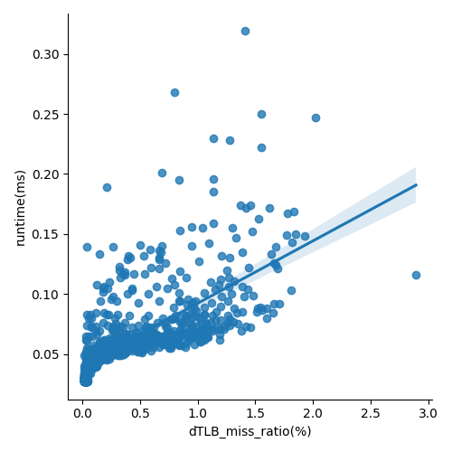

# Cache and Memory Performance Profiling
## The read/write latency of cache and main memory when the queue length is zero (i.e., zero queuing delay)


## The maximum bandwidth of the main memory under different data access granularity (i.e., 64B, 256B, 1024B) and different read vs. write intensity ratio (i.e., read-only, write-only, 70:30 ratio, 50:50 ratio)


## The trade-off between read/write latency and throughput of the main memory to demonstrate what the queuing theory predicts


## The Impact of Cache Miss Ratio
- In this experiment we use run time to measure the speed performance of software.
- The first step is to cause L1 cache miss in the software.
    + Cache miss can be caused by fetch value which is not in L1 cache. Using large arrays may meet the requirement.
    + We frist measure the size of our L1 cache, which is easy using 
```
lscpu | grep cache
```

    + The next step is randomly read the large array which has larger size than the L1 cache.
    + If the index of the array is random any time, the cache miss would finally happen.
- To make the process intuitive, we directly use the array size increase from `1024*sizeof(int)` to `1024*1024*sizeof(int)`. 
- To make the time calculation easier, we use 1000 multiplication operations as one unit to calculate cache miss and run time calculation. The measure and multiplication process are both in `miss_measure.c`
- To make sure the cache miss calculate not being affected by other process such as array initialization, we use `perf_event_open` API instead of perf command. 
- We measured 1000 results with increasing array size, the data is in `miss_out.csv`. The plot result is as follow:

- There will be several conclusion considering the figure
  - The result indicates that the cache miss ratio and run time are positively correlated.
  - when cache miss ratio is lower than 4 percent, the run time is influenced more slightly by cache miss. 

## The impact of TLB table miss ratio
- According to the discription above. The measure of TLB miss is similiar. 
- We still use large array to generate dTLB miss. (It is very hard to generate iTLB miss by simple multiplication operation. That need more complex software).
- The measure and multiplication are both in `miss_measure.c`
- The result data is in `miss_out.csv`, the plot figure is as follow:



- It could be discovered that, the dTLB miss ratio and runtime also positively correlated.


# Conclusion

1) Based on the results of our experimental study, we observe that for a fixed data access granularity of 64B,256B, and 1024B, an increase in the injection delay leads to a decrease in the latency, and the bandwidth decreases accordingly. Moreover, for a fixed data access granularity, an increase in the ratio of write operations leads to a slight increase in latency, but the bandwidth increases when the injection latency is small, while the bandwidth shows a similar pattern when the injection latency is large. These observations lead us to conclude that in memory, the latency of write operations is higher than the latency of read operations.
2) When the injection delay is chosen to be 0, the Bandwith at this point can be approximated as the Throuput, and through our experiments, we can observe that the latency rises gradually as the write ratio rises, while the Throuput shows a tendency of decreasing first and then increasing.

# Appendix

