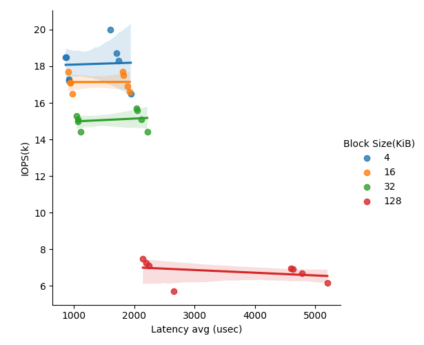
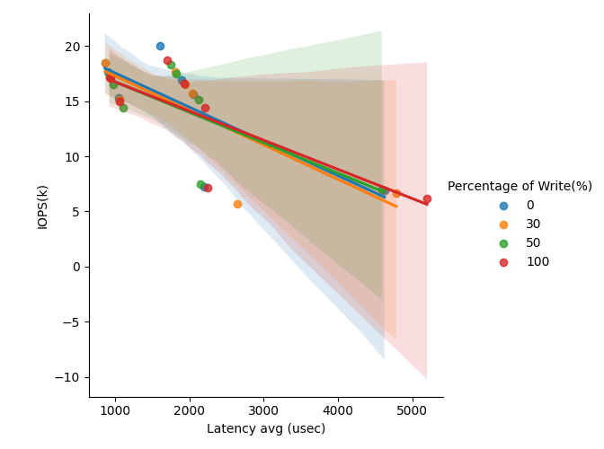
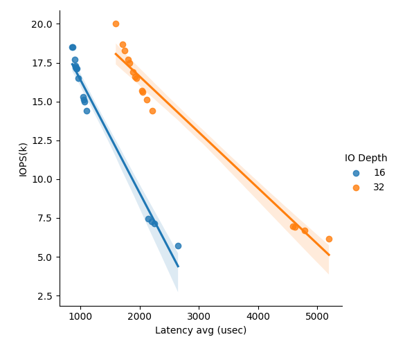

## SSD Performance Profiling
This is the Project 3 in Advanced-Computer-Systems-Fall2023.
### Instructions
This project helps to gain first-hands experience on profiling the performance of modern SSDs.

FIO is a storage device testing tool widely used in the
industry. Like Project 1, we should design a set of experiments to measure the SSD performance (latency and
throughput) under different combinations of the following parameters: 

1) data access size (e.g.,4KB/16KB/32KB/128KB)

2) read vs. write intensity ratio (e.g., read-only, write-only, 50%:50% and 70%:30% read vs. write)

3)  I/O queue depth (e.g., 0~1024)

### Quick Start
```
sh run.sh
```
### Results

IO Depth = 16

| Test Type          | Block Size | IOPS  | Bandwidth Read/Write | Latency min (usec) | Latency max (usec) | Latency avg (usec) | Bandwidth avg (KiB/s) | CPU usr | CPU sys | IO Depth  |
|--------------------|------------|-------|----------------------|--------------------|--------------------|--------------------|-----------------------|---------|---------|-----------|
| 100% write         | 4 KiB      | 17.2k  | 67.2MiB/s (70.5MB/s)| 46                 | 193143            | 921.60            | 68702.36            | 1.03%  | 7.21%  | 16        |
| 100% write         | 16 KiB      | 17.1k  | 267MiB/s (280MB/s)   |44                 | 10057            | 934.84            | 272247.79             | 1.89%  | 7.85%  | 16        |
| 100% write         | 32 KiB     | 15.0k | 470MiB/s (492MB/s)   |67                | 13457            | 1064.02            | 481854.36              | 1.20%   | 9.64%  | 16        |
| 100% write         | 128 KiB    | 7123  | 890MiB/s (934MB/s)  | 120               | 13041            | 2245.26            | 915574.15           | 1.24%  | 10.33%  | 16        |
| 50% read 50% write | 4 KiB      | 17.3k  | 67.7MiB/s (71.0MB/s)   | 56                | 12106             | 922.24            | 69515.69            | 1.67%  | 6.96%  | 16        |
| 50% read 50% write | 16 KiB      | 16.5k  | 258MiB/s (270MB/s)   | 85                  |14323            | 969.24          |264003.28             | 1.42%  |8.50%  | 16        |
| 50% read 50% write | 32 KiB     | 14.4k |451MiB/s (473MB/s)   | 47                 | 20000             | 1108.08            | 461900.56           | 1.59%  | 9.26%  | 16        |
| 50% read 50% write | 128 KiB    | 7463  | 933MiB/s (978MB/s)   |121                |9970             |2142.41           | 955963.08            | 1.50%   | 10.69%  | 16        |
| 70% read 30% write | 4 KiB      | 18.5k  | 72.1MiB/s (75.6MB/s) |51                | 15704             | 866.30             | 73803.28            | 1.34%  | 8.00% | 16        |
| 70% read 30% write | 16 KiB      | 17.1k  | 267MiB/s (280MB/s)   | 54                | 18619             | 935.96             |273599.18           | 1.54%  | 8.55% | 16        |
| 70% read 30% write | 32 KiB     | 15.1k | 471MiB/s (494MB/s) | 68                | 10253            | 1060.93             | 483260.72             | 1.97%  | 9.32% | 16        |
| 70% read 30% write | 128 KiB    | 5697  | 712MiB/s (747MB/s)   | 72                 | 815279             | 2649.41            | 74129.23             |1.93%   | 9.72%  | 16        |
| 100% read          | 4 KiB      | 18.5k | 72.4MiB/s (75.9MB/s)  |   58               | 14108            | 863.25            | 158843.52             | 1.84%  | 7.27%| 16        |
| 100% read          | 16 KiB      | 17.7k  |277MiB/s (290MB/s)   |56                 | 13739            | 902.80           | 284198.56             | 1.13%  | 8.96%  | 16        |
| 100% read          | 32 KiB     | 15.3k |478MiB/s (501MB/s)  | 171                 | 52675            | 1045.46                | 489193.03          | 1.26%   | 9.69%  | 16        |
| 100% read          | 128 KiB    | 7265  | 908MiB/s (952MB/s)   |135                 |20146            | 2200.9            | 932050.05            | 1.61%   | 10.19% | 16        |

IO Depth = 32

| Test Type          | Block Size | IOPS  | Bandwidth Read/Write | Latency min (usec) | Latency max (usec) | Latency avg (usec) | Bandwidth avg (KiB/s) | CPU usr | CPU sys | IO Depth  |
|--------------------|------------|-------|----------------------|--------------------|--------------------|--------------------|-----------------------|---------|---------|-----------|
| 100% write         | 4 KiB      | 18.7k | 73.2MiB/s (76.7MB/s)   | 581                  | 16811             | 1706.77            | 74944.21             | 1.50%  | 7.43%  | 32        |
| 100% write         | 16 KiB      | 16.6k  | 260MiB/s (272MB/s)   |59                  | 12927            | 1924.91            | 265614.77            | 1.10%  | 8.49%  | 32        |
| 100% write         | 32 KiB     | 14.4k | 451MiB/s (473MB/s)   | 65                 | 23236            | 2214.82            | 461064.21             | 1.74% | 9.27%  | 32        |
| 100% write         | 128 KiB    | 6153  | 769MiB/s (807MB/s)  | 199                | 27792            | 5197.46           | 789364.59             | 1.58%   | 9.19%  | 32        |
| 50% read 50% write | 4 KiB      | 18.3k  | 71.7MiB/s (75.1MB/s)   | 51                  | 13273               | 1743.53            | 73349.13              | 1.42%  | 7.32%  | 32        |
| 50% read 50% write | 16 KiB      | 17.5k  | 274MiB/s (287MB/s)  | 59                  | 15826             | 1824.65           | 280808.21            | 1.55%  | 8.62%  | 32        |
| 50% read 50% write | 32 KiB     | 15.1k | 471MiB/s (494MB/s)   | 62                 |22094            | 2120.57             |483324.72             |1.27%   | 9.99%  | 32        |
| 50% read 50% write | 128 KiB    | 6967  | 871MiB/s (913MB/s)   | 146                | 17213            | 4589.35           | 892297.85           |1.69%  |10.04%  | 32        |
| 70% read 30% write | 4 KiB      | 16.5k  | 64.3MiB/s (67.5MB/s) |34                 | 187904             |1941.82           | 64948.41           | 1.24%  | 6.82%  | 32        |
| 70% read 30% write | 16 KiB      |17.7k | 276MiB/s (289MB/s)   | 51                 | 11766             | 1811.40            | 283097.44             | 1.55%  | 9.03%  | 32        |
| 70% read 30% write | 32 KiB     | 15.7k | 490MiB/s (514MB/s) | 59                | 21633             | 2039.22            | 502580.51            | 1.67%   | 9.59% | 32        |
| 70% read 30% write | 128 KiB    | 6686  | 836MiB/s (876MB/s)   | 138                 | 27701             | 4783.0          | 855151.59            | 1.74%   | 9.75%  | 32        |
| 100% read          | 4 KiB      |20.0k  |78.1MiB/s (81.9MB/s)  |50                 | 19637           | 1599.02               | 80090.46          | 1.61% | 7.63%  | 32        |
| 100% read          | 16 KiB      | 16.9k  | 264MiB/s (277MB/s)   | 52                  |19367             |1889.50            | 270675.69             | 1.66%  | 8.38%  | 32        |
| 100% read          | 32 KiB     | 15.6k | 488MiB/s (512MB/s)  |58                  |15807            |2046.43                | 500114.05          |1.35%  | 10.11% | 32        |
| 100% read          | 128 KiB    | 6914  | 864MiB/s (906MB/s)  | 162                 | 16979             | 4625.46            | 886396.72             | 1.64%   | 10.28%  | 32 |

### Figures


